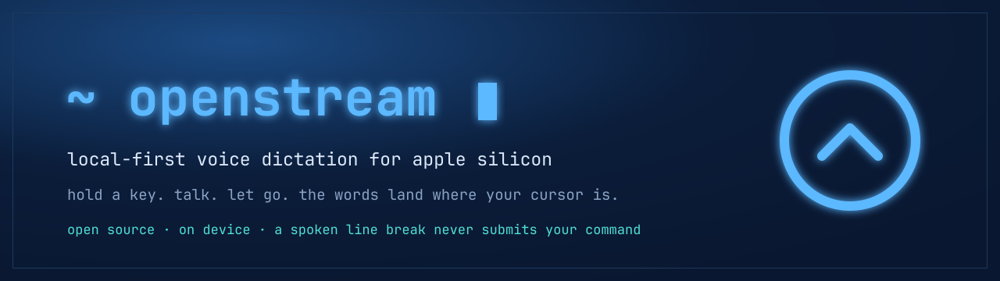

<div align="center">

# OpenStream


&nbsp;
&nbsp;
&nbsp;

Local-first voice dictation for developers. Hold a key, talk, let go.<br>
The words land at your cursor and never leave your Mac.

</div>



<!-- demo.gif goes here once recorded on device (#21) -->

## Why

A spoken "new paragraph" can fire off a half-typed shell command or send an unfinished message. OpenStream checks the frontmost app and the focused field first, so a line break only happens where a line break is safe. Everywhere else the words just carry on.

It is Wispr Flow rebuilt as free software: open source, no account, and nothing phones home.

## Install

From source, which is the supported path:

```bash
git clone https://github.com/Nabzx/openstream.git
cd openstream && npm install && npm start
```

You need Apple Silicon, macOS 14 or newer, Node 22.12+ and Xcode Command Line Tools. `npm install` builds three Swift helpers (the first build compiles FluidAudio, so it is slow) and fetches the rewrite model. The transcription model, about 1 GB, downloads on the first launch.

There is an unsigned beta DMG on the [releases page](https://github.com/Nabzx/openstream/releases). Gatekeeper will warn, and a rebuild resets the macOS permissions, so `git clone` stays the real path.

## Permissions

Three grants, done once: Microphone, Input Monitoring, Accessibility. The app opens on a Permissions screen if any are missing, and `npm run doctor` checks from the terminal. Grant them, then quit and restart. A rebuild re-keys the grants, so remove the old OpenStream entry in System Settings before adding the new one.

## How it works

- Parakeet (NVIDIA), via FluidAudio, transcribes on the Neural Engine, resident for the app's life.
- A deterministic rules engine cleans the text. No model rewrites your words. See [ADR-0001](docs/adr/0001-no-llm-in-the-dictation-path.md).
- A small local model places paragraph breaks in long dictations and returns sentence numbers, never text.
- The hotkey and the text injection run in separate Swift processes, so a stuck Accessibility call cannot take down the shortcut.

## Status

Beta, feature-complete for 1.0. A final on-device verification pass ([#228](https://github.com/Nabzx/openstream/issues/228)) is what stands between here and the `v1.0.0` tag.

## Development

```bash
npm run dev      # Vite renderer + Electron
npm test         # unit tests
npm run dist     # unsigned DMG under release/
```

More: [ROADMAP](ROADMAP.md), [CONTEXT](CONTEXT.md), [progress notes](docs/progress/).

## Licence

[MIT](LICENSE)
