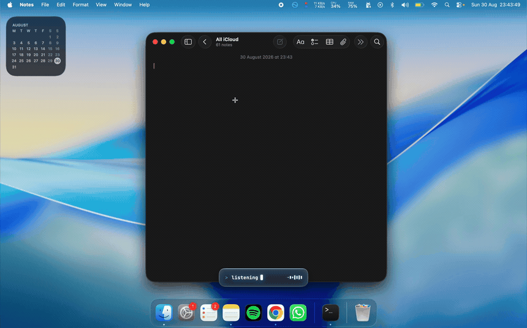

<div align="center">

# OpenStream


&nbsp;
&nbsp;
&nbsp;

Local-first voice dictation for developers. Hold a key, talk, let go.<br>
The words land at your cursor and never leave your Mac.

</div>



## Why

Wispr Flow is good, but it wants a subscription and an account, and your voice goes to their servers. OpenStream does the same job for free, on your Mac, with no sign-up.

It also tries not to break your flow. Before it types a line break it checks which app you are in, so saying "new paragraph" cannot fire off a half-typed command or send an unfinished message.

## Install

From source, which is the supported path:

```bash
git clone https://github.com/Nabzx/openstream.git
cd openstream && npm install && npm start
```

You need Apple Silicon, macOS 14 or newer, Node 22.12+ and the Xcode command line tools. `npm install` builds three Swift helpers, so the first run is slow. The transcription model (about 470 MB) downloads the first time you open the app.

There is an unsigned beta DMG on the [releases page](https://github.com/Nabzx/openstream/releases), but Gatekeeper will complain and a rebuild wipes the permissions, so building from source is the better route.

## Permissions

macOS makes you allow three things, once: Microphone, Input Monitoring and Accessibility. The app tells you on launch if any are missing, or run `npm run doctor`. Grant them, quit, reopen.

Rebuilding the app resets these grants, so delete the old OpenStream under System Settings > Privacy & Security before adding the new one.

## How it works

- Parakeet (NVIDIA), via FluidAudio, transcribes on the Neural Engine and stays loaded for the life of the app.
- A deterministic rules engine tidies the text. No model rewrites your words ([ADR-0001](docs/adr/0001-no-llm-in-the-dictation-path.md)).
- A small local model decides where paragraph breaks go in long dictations. It returns sentence numbers, never text.
- The hotkey and the text injection run as separate Swift processes, so a stuck Accessibility call cannot take the shortcut down with it.

## Status

Beta, `v1.0.0` tagged. The on-device verification pass ([#228](https://github.com/Nabzx/openstream/issues/228)) is done. [Known rough edges, and what's next](https://github.com/Nabzx/openstream/issues/340) is the place to start: accuracy on short clips, spoken numbers coming through spelled out, and a slower first dictation right after launch. The full list is on the [v1.1 milestone](https://github.com/Nabzx/openstream/milestone/6).

## Development

```bash
npm run dev       # Vite renderer + Electron
npm test          # vitest + node --test
npm run typecheck
npm run dist      # unsigned DMG under release/
```

More: [ROADMAP](ROADMAP.md), [CONTEXT](CONTEXT.md), [progress notes](docs/progress/), [ADRs](docs/adr/).

## Contributing

Issues are tagged by milestone. Anything on [v1.1](https://github.com/Nabzx/openstream/milestone/6) is fair game. Pick one, say so on the issue so nobody doubles up, then open a PR from a branch.

Every PR gets a review before it merges, and CI (`npm run build`) has to pass. Run `npm test` and `npm run typecheck` locally first. Keep commits small and the messages plain.

Before a change that touches how the pipeline behaves, read the matching doc: `CONTEXT.md` is the glossary, `docs/adr/` records the decisions and why they went that way, `docs/progress/` is the running history. `AGENTS.md` lists the few hard invariants.

Not a coder? There's no company behind OpenStream and no marketing budget. If it's useful to you, [a star and a word to one other person](docs/marketing/spread-the-word.md) is the biggest help there is.

## Licence

[MIT](LICENSE)
